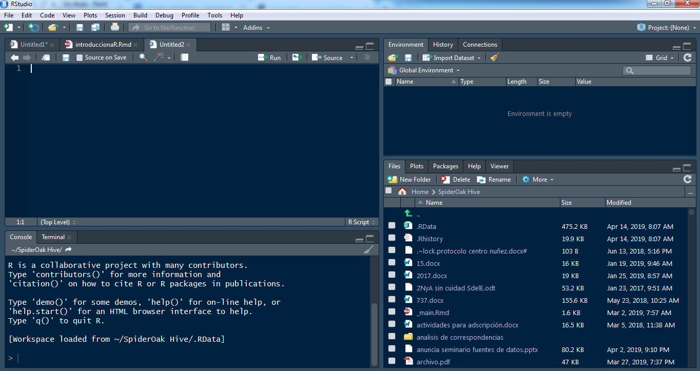

```{r setup, include=FALSE}
knitr::opts_chunk$set(echo = TRUE, warning = FALSE)
options(scipen=10000)
```

# Presentación  
Este curso es una introducción a R dirigido a investigadores en Ciencias Sociales y busca facilitar la aproximación a un software cuyo uso en investigación tiene ventajas que superan en mucho las dificultades que suelen aparecer en los primeros intentos.   

Para realizar análisis de datos existen numerosos programas informáticos, que se ocupan de los procesos computacionales, de manera que el usuario solo deba decidir qué procedimiento aplicar, cuidar que se cumplan las condiciones que hacen válido al procedimiento (los supuestos) y realizar una lectura correcta y completa del resultado que se obtiene, sin involucrarse con las operaciones de cálculo. Estos programas o "paquetes estadísticos" reúnen en un entorno único las operaciones más frecuentemente usadas por investigadores y analistas de datos y las ponen al alcance del usuario no especializado. Algunos de uso muy común son SPSS, SAS, INFOSTAT, STATA, STATISTICAL, etc. De la larga lista de opciones disponibles, este manual usa un software que se llama R, elección que se fundamenta en que R es varias cosas al mismo tiempo:

Es un software para análisis de datos: lo usan profesionales de la estadística, analistas de datos e investigadores de diversas disciplinas para extraer significado de información cuantitativa, para hacer descripciones e inferencias, visualización de datos y modelización predictiva.

Es un lenguaje de programación orientado a objetos, diseñado por estadísticos y para el uso en investigación cuantitativa: el análisis se hace escribiendo sentencias en este lenguaje, que provee objetos, operadores y funciones que hacen muy intuitivo el proceso de explorar, modelar y visualizar datos.

Es un ambiente para el análisis estadístico: en R hay funciones para prácticamente todo tipo de transformación de datos, de modelización y de representaciones gráficas que pueda hacer falta.

Es un proyecto de código abierto: esto significa no solo que se lo puede descargar y usar gratis, sino que el código es abierto y cualquiera puede inspeccionar o modificar las rutinas. Como sucede con otros proyectos de código abierto, como Linux, R ha mejorado sus códigos tras varios años de "muchos ojos mirando" y aportando soluciones. También como otros proyectos de código abierto, R tiene interfaces abiertas, por lo que se integra fácilmente a otras aplicaciones y sistemas.

Es una comunidad: R fue inicialmente desarrollado por Robert Gentleman y Ross Ihaka [@Ross1996], del Departamento de Estadística de la Universidad de Auckland, en 1993 y desde entonces el grupo que dirige el proyecto ha crecido y se ha difundido por el mundo. Además, miles de otras personas han contribuido con funcionalidades adicionales por medio del aporte de "paquetes" que utilizan los 2 millones de usuarios de todo el mundo. Como resultado, existe una intensa comunidad de usuarios de R on-line, con muchos sitios que ofrecen recursos para principiantes y para expertos. A esa comunidad se puede recurrir para consultas y para salvar dificultades, son muy activas y dispuestas a ayudar.


R integra programas llamados paquetes, que sirven para realizar análisis específicos. Los paquetes son rutinas que realizan conjuntos de operaciones especializadas, y una de las potencialidades de R es que diferentes investigadores pueden  desarrollar paquetes para determinados tipos de análisis y ponerlos a disposición de los demás usuarios. En la actualidad hay más de 10000 paquetes y el conjunto crece porque la comunidad R es muy activa y continuamente se hacen aportes. 

Actualmente, los principales medios de comunicación usan R para expresar datos de manera gráfica.

No solo cuenta con los métodos estándar sino que, debido a que los principales avances en procedimientos estadísticos se realizan en R, las técnicas más actualizadas están usualmente primero disponibles en R, a los desarrolladores de paquetes comerciales les lleva más tiempo poner las actualizaciones al alcance de los usuarios. Y los usuarios a menudo deben pagar por las actualizaciones.

Permite la reproducción de los análisis por parte de cualquiera que conozca el código que se aplicó, por lo que aporta una herramienta necesaria en los proyectos de ciencia abierta, en especial para la reproducibilidad de los resultados.

Por estas razones, R es uno de los lenguajes de programación que más uso tiene y se está convirtiendo en la lingua franca del análisis de datos.

Como lenguaje, R tiene varias interfaces gráficas, que es el modo en que las personas puede interactuar con él. R es el motor y del mismo modo en que, para manejar un auto no hace falta saber cómo funciona el motor, también aquí será suficiente contar con un buen conjunto de comandos (volante, pedales…) para hacer uso de la potencia de ese motor, la interface provee esos comandos. De las interfaces existentes, hemos elegido RStudio [@RStudioTeam2018] que es un entorno de desarrollo integrado (IDE) de R para facilitar la edición de código que ofrece diversas herramientas para hacer muy accesible el uso de R por parte de quienes no se dedican a la programación, sino que son usuarios de procedimientos estadísticos. Además, es posible crear una cuenta en  RStudio cloud (https://rstudio.cloud/), desarrollar allí un proyecto o bien subir uno que se tenga en curso, y trabajar con todos los archivos disponibles en la nube, sin necesidad de instalar localmente el software.  
Una línea de tiempo sobre el desarrollo de R puede encontrar en https://blog.revolutionanalytics.com/2017/10/updated-history-of-r.html  

Este curso busca proveer una primera aproximación a este entorno para quienes tienentengan o no experiencia en otros programas de análisis de datos y cuenten con una base conceptual de estadística.

# Los datos  
Para ilustrar los procedimientos, en este taller se usan datos proveninetes de la Encuesta Permanente de Hogares. La EPH es un programa nacional de producción permanente de indicadores sociales cuyo objetivo es conocer las características socioeconómicas de la población. Es realizada en forma conjunta por el Instituto Nacional de Estadística y Censos (INDEC) y las Direcciones Provinciales de EstadÌstica (DPE) (@INDEC2003). Los datos se recogen por medio de dos cuestionarios; uno de ellos que pregunta por características del hogar y la vivienda y el otro por las personas individualmente.

# El software  

## Instalación local de R y RStudio

En [http://cran.r-project.org](http://cran.r-project.org) "Download R for [Linux, Mac o Windows]", y luego "install R for the first time". Una vez descargado, se instala siguiendo las instrucciones de las pantallas, aceptando las opciones por defecto que se ofrecen. 

Una vez que R está instalado, se debe sumar RStudio. El lugar de descarga es [http://www.rstudio.com/products/rstudio/download/](http://www.rstudio.com/products/rstudio/download/). Allí se elige la version gratis (free version) de RStudio Desktop y se baja hasta encontrar el sistema operativo y la version que corresponda a nuestro equipo. Luego se ejecuta el instalador de RStudio y se eligen las opciones por defecto. Cuando esté ya instalado, se accede por medio de RStudio; si al instalar R se creó un acceso directo a R en el escritorio, se lo puede eliminar. Al abrir RStudio, R es detectado automáticamente y desde allí operaremos.  

## RStudio en la nube  
A los fines de este taller, se creará una cuenta en RStudio cloud y en ella, un nuevo proyecto desde un repositorio (repo) existente en GitHub. La dirección es https://github.com/ebologna/R-en-demo.git. Si se desea, se puede hacer la instalación local de R y RStudio como se indica arriba y descargar los archivos de ese repositorio.  

## Los componentes de RStudio {.unnumbered}

Cuando abrimos RStudio, vamos a encontrar tres paneles, uno a la izquierda, más grande, y dos a la derecha. En "file" se solicita un nuevo script, que se abre a la izquierda y ahora quedan cuatro paneles: 




- Superior izquierdo es el script que se acaba de abrir, un documento editable en el que se escriben los comandos.

- Inferior izquierdo es la consola, donde se encuentra la ejecución de los comandos y, si corresponde, los resultados de operaciones solicitadas.

- Superior derecho es el entorno de trabajo, allí aparece cada uno de los objetos que se crean durante la sesión.

- Inferior derecho, cuatro pestañas con los directorios de trabajo, los paquetes instalados, la ayuda (cuando se pide), los gráficos que se hagan.

## Instalación de paquetes

Cuando se descarga R y RStudio se cuenta con el sistema básico del lenguaje R. Las operaciones mencionadas en el apartado anterior y otras, están disponibles en esa base. Sin embargo, una gran cantidad de procedimientos están programados y ofrecidos como "paquetes", que sirven para tareas específicas. Su creación y desarrollo es parte de la potencialidad de R, porque son aportes de la comunidad que los diseña y los ofrece continuamente. En la actualidad hay más de 10000 paquetes en la CRAN (Comprehensive R Archive Network) aplicables a una gran diversidad de procedimientos.

La instalación de paquetes de R puede hacerse desde la línea de comando con la instrucción install.packages("") y el nombre del paquete entre comillas, también puede hacerse más directo, porque la IDE RStudio tiene, en el panel inferior derecho, una pestaña (la tercera) que dice *packages* y en ella, una opción *install* que abre una ventana para escribir (con autocompletado para los existentes) el nombre del paquete que se quiere instalar. Ahora vamos a instalar todos los paquetes que necesitaremos en este recorrido:  
```{r eval=FALSE}
install.packages("questionr")
install.packages("ggplot2")
install.packages("ggthemes")
install.packages("mblm")
install.packages("RColorBrewer")
install.packages("viridis")
install.packages("demography")
```

Estas instalaciones se realizan por única vez en cada computadora y luego, en cada sesión que vayan a usarse, se deberán cargar con la instrucción `library()`.  
Trabajaremos primero con los comandos que trae el paquete `base`, que viene por defecto con la instalación de R.  

## Escribir y ejecutar comandos  

Antes de empezar a operar es necesario crear un lugar donde se alojarán los archivos que vamos a usar. Ese lugar, en R se llama "proyecto". Así, la primera acción será en File $\rightarrow$ New Project $\rightarrow$ New Directory $\rightarrow$ New Project, darle un nombre y definir su ubicación en la computadora en que se trabaje. Si esa ubicación es una carpeta sincronizada (de drive o dropbox u otra) todos los archivos necesarios para trabajar en el proyecto estarán disponibles.  

El script es un editor de textos en que se escriben comandos y se ejecutan, ya sea con el botón “run” o con una combinación de teclas que, según la configuración puede ser Ctrl+R o Ctrl+Enter. Una vez escrita la instrucción, se solicita su ejecución y se obtiene el resultado.

```{r echo=TRUE}
1+2
```

Los elementos que maneja R son objetos: un número, un vector, una base de datos, una tabla y muchos otros. Inicialmente, los que interesan a fin del análisis de datos son: vectores y matrices de datos.

## Clases de objeto  

Un objeto numérico puede tener un valor fijo, si definimos a **x** como el número 3  

```{r echo=TRUE}
x <- 3
```

En el panel superior derecho aparece este objeto. El signo $<-$ que define el objeto es equivalente a $=$ que da la idea de asignar a **x** el valor **3**. No hay un resultado visible de esta operación, ya que solo consistió en definir a **x** como igual a **3**

Si se lo invoca (se lo llama es decir, se escribe su nombre), muestra su valor.


```{r echo=TRUE}
x
```

Se puede hacer de una sola vez la asignación y la visualización del resultado, encerrando la expresión entre paréntesis:

```{r}
(x<-3)
```

De este modo se asigna a **x** el valor **3** y se lo muestra.  

Las salidas de R, es decir los resultados que muestra, están antecedidos por un signo numeral (#) y cada elemento de los resultados lleva su numeración entre corchetes. Aquí el resultado es solo un número, por eso hay un [1] a la izquierda.  
Este objeto es un número, lo que puede saberse si se pregunta de qué clase es este objeto:

```{r echo=TRUE}
class(x)
```

Es numérico.

Si hubiésemos definido el objeto:

```{r echo=TRUE}
t <- "a"
class(t)
```


Es carácter, para que lo acepte como valor nuevo, se debe poner entre comillas; de lo contrario, si se escribe:

$t<-a$

Buscará ese objeto, que no ha sido definido antes y dará error. Esta cualidad se puede usar cuando los números codifican categorías, como cuando se usa 1 para varones y 2 para mujeres:

```{r echo=TRUE}
u <- "1"
class(u)
```

Allí se entiende al número como un código.

Otros tipos de objeto son lógicos

```{r echo=TRUE}
v <- TRUE
class(v)
```

El objeto **v** es lógico, esta clase de objeto puede tomar dos valores TRUE y FALSE.

Es posible transformar una clase de objeto en otra. Por ejemplo, si un valor numérico fue cargado como carácter, como el caso de **u** en el ejemplo anterior, se lo vuelve numérico pidiendo:

```{r echo=TRUE}
u <- as.numeric(u)
class(u)
```

Pero si intentáramos eso con **t**, el resultado falla, porque no se interpreta un valor numérico.


Los valores textuales corresponden a dos clases diferentes de objetos R: caracteres y factores, que difieren en el modo en que R los almacena internamente. Los factores se guardan como números y una tabla que hace corresponder a cada uno un texto, mientras que los vectores de caracteres se guarda cada texto como un valor, por lo que consume más memoria. Por defecto, los valores textuales son tomados como ed clase caracer. Sea $x$ el valor "a":

```{r echo=TRUE}
x<-"a"
class(x) # carácter

# Transformado a numérico:
x<-as.numeric(x) # produce NA
```

```{r echo=TRUE}
x
```

Si se lo define como factor:
```{r echo=TRUE}
x<-as.factor("a")
levels(x)
# llevado a numérico:
x<-as.numeric(x) 
x

```

Le asigna el número 1.

Cuando el objeto es un número, se puede operar simplemente con él

```{r echo=TRUE}
x<-8
5 * x
```


Aquí, el resultado de la operación no es un objeto nuevo, solo se mostró el resultado. Para crearlo, hace falta ponerle nombre:
```{r echo=TRUE}
y <- 5 * x
```

Y no veremos su valor hasta que no lo solicitemos

```{r echo=TRUE}
y
```

Suma resta, multiplicación y división se hacen con los signos que conocemos:

```{r echo=TRUE}
x + y
x - y
x * y
y / x
6 * x + 4 * y
```

Para elevar a una potencia se usa ^, por ejemplo, para hacer dos a la tercera potencia, es:

```{r echo=TRUE}
2^3
```


O $x$ (que está guardado con el valor 3) a la quinta potencia:

```{r echo=TRUE}
x^5
```

Las raíces son potencias fraccionarias, por lo que puede conseguirse la raíz cuadrada de $x$ así:

```{r echo=TRUE}
x^(1/2)
```

Pero como se usa a menudo, hay una función de biblioteca para eso:

```{r echo=TRUE}
sqrt(x)
```

Para raíces que no sean cuadradas, se debe usar la potencia fraccionaria. Para la raiz quinta de 24 es:

```{r echo=TRUE}
24^(1/5)
```

Un comando útil es el de redondeo. Si no queremos expresar la raiz de siete con seis decimales, sino solo con dos, se redondea a dos decimales:  

```{r echo=TRUE}
x <- sqrt(7)
x
round(x, 2)
## o todo de una sola vez:
round(sqrt(7), 2)
```


## Vectores  
Cuando se trabaja con variables, el conjunto de valores que asume es un objeto que se llama vector. Se lo genera con una letra $c$ y paréntesis que indica concatenar valores. Por definición, un vector contiene elementos de la misma clase:

```{r echo=TRUE}
a <- c(1, 5, 8)
b <- c("x", "y", "z")
class(a)
class(b)
```

Si se intenta combinar diferentes clases de objeto, el vector tomará la clase con menos propiedades:

```{r echo=TRUE}
l <- c(1, 3, "a")
class(l)
```

Cuando pedimos que muestre los elementos de l:
```{r echo=TRUE}
l
```

Aparecen los números 1 y 3 entre comillas, lo que indica que los está tomando como caracteres, por lo que no podrá operar con ellos. Si lo intentamos por ejemplo, multiplicandolo por cinco, se obtiene un error:  

Error in 5 * c : non-numeric argument to binary operator  

Esto sucede porque los números fueron tratados como caracteres.  

Ejemplo: Los valores de PBI de cinco países son 10000, 3000, 7000, 4000 y 15000, se los puede concatenar así, definiendo el vector que los contiene con el nombre pib5:

```{r echo=TRUE}
pib5 <- c(10000, 3000, 7000, 4000, 15000)
```

Y se pueden hacer operaciones con él, por ejemplo, sumar sus valores

```{r echo=TRUE}
sum(pib5)
```

O sumarlos y dividir por 5, que va a dar el promedio:


```{r echo=TRUE}
sum(pib5) / 5
```


Pero para esto hay una función de biblioteca que calcula la media (promedio) directamente.

```{r echo=TRUE}
mean(pib5)
```

O definir un nuevo vector que consista en cada uno de ellos incrementado en un 10%:

```{r echo=TRUE}
pib5_10 <- 1.1 * pib5
pib5_10
```


Un vector puede crearse de este modo, concatenando varios valores, o bien como secuencia de números, por ejemplo creamos el vector $diez.pri$ como la secuencia de los números que van del 1 al 10, y pedimos que se muestre:  

```{r echo=TRUE}
diez.pri <- 1:10
diez.pri
```

Como puede verse, una vez que los objetos han sido creados, RStudio ofrece el autocompletado, eso vale también para comandos, por lo que no hace falta recordar con precisión el nombre de cada uno, se empieza a escribirlo y RStudio lo sugiere.  

Si se quiere que la secuencia tenga saltos de magnitud diferente a 1, el comando es `seq`, cuyos argumentos son: los números inicial y final de la secuencia y la amplitud del salto de cada valor al siguiente. Para ir del 1 al 10 de a 0.50:  

```{r echo=TRUE}
seq(1, 10, .5)
```

En este ejemplo, no creamos ningún objeto, solo solicitamos la secuencia para verla. El [16] que está debajo del [1] indica que el valor 8.5 ocupa el lugar 16 de la secuencia.   

El comando `rep`, repite un valor las veces que se solicite, repetir el valor 4, siete veces es:

```{r echo=TRUE}
rep(4, 7)
```

O el valor "perro", tres veces:

```{r echo=TRUE}
rep("perro", 3)
```

Estas maneras de generar secuencias pueden combinarse:

```{r echo=TRUE}
c(1:5, seq(1, 7, .8), rep(65, 4))
```

Notemos que hay un decimal (cero) en los enteros, eso es porque los números que componen el vector fueron interpretados como valores reales y no como enteros, como sucedió en el ejemplo anterior. Con que haya un solo número decimal, todos los componentes del vector son tratados como tales, a los enteros les corresponderá parte decimal igual a cero. Un vector siempre contiene elementos de la misma clase.  

Una clase de vector frecuente cuando se trata con variables cualitativas es el "factor", que está constituido por números que corresponden a etiquetas de valor. Por ejemplo, se define un vector como los códigos 1 y 2 para personas pertenecientes a los grupos experimental y control respectivamente y pedimos que se muestre:  
```{r echo=TRUE}
grupo <- c(1, 2)
class(grupo)
grupo
```
Es un vector numérico con valores 1 y 2. Luego indicamos que lo trate como un factor y volvemos a pedir su visualización:
```{r echo=TRUE}
grupo <- as.factor(grupo)
class(grupo)
grupo
```

Se trata de un factor y, si bien sus valores siguen siendo 1 y 2, ahora son llamados "niveles del factor". Los niveles pueden preguntarse explícitamente: 
```{r echo=TRUE}
levels(grupo)
```

Y también definirse, como etiquetas:
```{r echo=TRUE}
levels(grupo) <- c("experimental", "control")
```

Ahora éstos son los nuevos niveles:
```{r echo=TRUE}
levels(grupo)
```

Observemos la diferencia que esto tiene con haber evitado la codificación numérica y definir:
```{r echo=TRUE}
grupo_2 <- c("experimental", "control")
class(grupo_2)
grupo_2
grupo_2 <- as.factor(grupo_2)
levels(grupo_2)
grupo_2
```

Como el vector fue creado como de caracteres, sus valores se ordenan alfabéticamente. Cuando se muestra el vector, los niveles aparecen en el orden que elegimos, pero cuando se lo vuelve factor, se los ordena alfabéticamente. Eso es un problema que resolvemos evitando los vectores  de caracteres. Cuando deben usarse, se realiza una codificación numérica y luego se etiquetan los niveles.  

Si 10 personas han sido asignadas al grupo experimental y otras 10 al grupo control, el vector que representa su pertenencia puede ser:
```{r echo=TRUE}
pertenencia <- c(rep(1, 10), rep(2, 10))
pertenencia <- as.factor(pertenencia)
levels(pertenencia) <- c("experimental", "control")
```


Así como `class` indica de qué clase es un objeto, existen comandos para preguntar por características específicas de los objetos y obtener respuestas por sí o por no. Por ejemplo, si se pregunta si el valor de $x$ (recién definido) es un factor:

```{r echo=TRUE}
is.factor(x)
```
O si uno dividido cero es infinito:
```{r echo=TRUE}
is.infinite(1 / 0)
```

Estos comandos da un resultado de clase lógica, con FALSE y TRUE como posibilidades.  

Los corchetes, [], permiten seleccionar elementos de un vector. La lectura es que, del vector, se retienen los valores que cumplen con la condición que está dentro del corchete. Se define $z$, como la secuencia de 1 a 6 y luego a h como los elementos de z que sean menores a 5:
```{r echo=TRUE}
z <- c(1, 2, 3, 4, 5, 6)
h <- z[z < 5]
z
h
```

La longitud de un vector es el número de elementos que contiene, se solicita con el comando `length`:

```{r echo=TRUE}
length(z)
length(h)
```


En la variable pertenencia, los niveles son:
```{r echo=TRUE}
levels(pertenencia)
```
Mientras que los valores:
```{r echo=TRUE}
pertenencia
```

La longitud del vector es:
```{r echo=TRUE}
length(pertenencia)
```

## Matriz de datos  
Cuando se combinan varios vectores, todos de la misma longitud, se construye un "data frame", una matriz de datos, cuyo formato más frecuente es que tenga los casos en las filas y las variables en las columnas; cada columna es un vector que contiene los valores de cada variable.  
Por ejemplo, si tenemos 10 observaciones que corresponden a 7 varones y 3 mujeres, que son estudiantes de la universidad, y el vector que  representa el sexo de esas personas, con las categorías codificadas como 1 y 2, es:  
```{r echo=TRUE}
sexo <- c(rep(1, 7), rep(2, 3))
sexo <- as.factor(sexo)
levels(sexo) <- c("varones", "mujeres")
```

Se ha creado el vector *sexo* por medio de la concatenación de dos repeticiones, del 1 siete veces y del 2, tres veces. Luego se trató a ese vector como un factor y se etiquetaron sus niveles. El siguiente vector contiene las edades de las mismas personas:  
```{r echo=TRUE}
edad <- c(25, 28, 31, 20, 21, 22, 25, 28, 28, 28)
```

Entonces, se crea una matriz de datos con el comando:  

```{r echo=TRUE}
sexo_edad_estudiantes <- data.frame(sexo, edad)
```

En el panel superior derecho han aparecido los objetos que acaban de crearse. De este último se indica allí la cantidad de casos (observaciones) y de varables. Cuando se lo cliquea, se obtiene una vista en una ventana separada del script.  
La misma vista puede lograrse con el comando:  

```{r  echo=TRUE, eval = FALSE}
View(sexo_edad_estudiantes)
```


Esto que ha sido creado es un nuevo objeto, de clase:

```{r echo=TRUE}
class(sexo_edad_estudiantes)
```

Y cuyos atributos son:

```{r echo=TRUE}
attributes(sexo_edad_estudiantes)
```

Los nombres (names) son las denominaciones de las columnas (las variables), la clase es lo que solicitamos antes y row.names son los nombres de las filas, que por defecto coloca numerada consecutivamente. Cada uno de esos atributos está precedido por un signo pesos, ese es el modo de acceder a cada uno de ellos. Por ejemplo, para ver el vector que representa el sexo, pedimos:  
```{r echo=TRUE}
sexo_edad_estudiantes$sexo
```

El signo pesos separa el nombre de la matriz de datos del nombre de la variable: df$x quiere decir, la variable "x", perteneciente a la matriz "df".   
Los números entre corchetes (el [1] y [9] en este ejemplo) indican el número del primer elemento de esa fila. Podemos preguntar de qué clase es este vector:

```{r echo=TRUE}
class(sexo_edad_estudiantes$sexo)
```

Por defecto lo leyó como factor, con los dos niveles que se indican más arriba. A ellos se puede llegar directamente:  
```{r echo=TRUE}
levels(sexo_edad_estudiantes$sexo)
```

Y se los puede redefinir:  

```{r echo=TRUE}
levels(sexo_edad_estudiantes$sexo) <- c("femenino", "masculino")
```

Ahora la matriz se ve:

```{r  echo=TRUE, eval = FALSE}
View(sexo_edad_estudiantes)
```

Esta matriz de datos puede guardarse para usos posteriores, para no tener que volver a correr la sintaxis la próxima vez que la necesitemos:
```{r echo=TRUE}
write.table(sexo_edad_estudiantes,
            "sexo_edad_estudiantes.csv",
            sep = ";", row.names = FALSE)
```

Hemos pedido que escriba la tabla con el mismo nombre (no es obligación), como archivo csv y que no ponga nombre a las filas. Esto pultimo es necesario, orque de los contrario aparece una nueva columna y los nombres de las variables se desplazan una celda a la izquierda.  Como no indicamos otra cosa, la matriz será guerdada en el directorio de trabajo.  

El primer resumen útil de las variables de una matriz de datos es la tabla univariada. Para cada una de las dos variables, tenemos:  
```{r echo=TRUE}
table(sexo_edad_estudiantes$sexo)
table(sexo_edad_estudiantes$edad)
```

### Lectura de una matriz de datos  
Es poco frecuente la creación de matrices de datos en R, salvo a fines de ejemplificación. Por el  contrario, a menudo es necesario leer un base que está guardada con un determinado formato (xls, ods, sav, sas, txt, csv, etc). El comando genérico es `read.table`, que requiere especificación sobre los simbolos que separan los campos y los decimales, si la primera fila lleva el nombre de las variables. Otros comandos más específicos son `read.csv`, `read.csv2`, el primero usa como separador por defecto ",", el segundo usa ";" y no necesitan que se indique si están los  nombres de las variables, porque por defecto los toman. A modo de ejemplo, leemos la base de la Encuesta Permanente de Hogares correspondiente al tercer trimestre de 2018. El archivo tiene formato de texto (.txt) y se llama "usu_individual_T318.txt". Vamos a darle el nuevo nombre de eph.3.18:  
```{r echo=TRUE}
eph.3.18 <- read.table("usu_individual_T318.txt",
  sep = ";", header = TRUE
)
```

Hemos indicado:  

- El nombre del archivo a leer junto con la ruta para llegar a él, muy conveniente que esté en el directorio de trabajo.  
- El separador de campos: suelen ser comas, punto y comas, tabulaciones, espacio en blanco o pipe | (alt124 en windows). Si los campos están separados por comas, se indica $sep=","$ y así con los demás separadores, siempre entrecomillados.  
- Que el archivo tiene encabezado: este es el caso casi siempre, porque la primera fila de la matriz de datos tiene los nombres de las variables. Se indica: $header=TRUE$.  
- Si a los casos perdidos estuviesen codificados de algún modo particular, por ejemplo como 9999, debe indicarse $na.strings="9999"$.  
Conviene mirar la base original, desde el archivo .txt, que puede abrirse con bloc de notas, para asegurarse qué sepadores tiene.

En el panel superior derecho aparece la matriz de datos y su tamaño. 


## Graficar  
Para ver un ejemplo de gráfico básico, puede copiar y pegar el siguiente código en su script. Allí se define a $x$ como una secuencia de números que va de 1 a 10 en intervalos de 0.1. Luego se define $y$ como una función lineal de $x$ ($y=3-2*x$). El tercer comando indica que se grafiquen las dos variables y les pone nombre a los ejes y al título del gráfico.

```{r echo=TRUE}
x <- seq(1, 10, .1)
y <- 3 - 2 * x
plot(x, y,
  xlab = "valor de x", ylab = "valor de y",
  main = "Función lineal decreciente"
)
```

A la función se puede agregar una perturbación aleatoria, en este caso se suman 91 casos (que es la cantidad de valores que tiene x) provenientes de una distribución normal con media uno y desviación estándar cero:
```{r}
y <- 3 - 2 * x + rnorm(91)
plot(x, y,
  xlab = "valor de x", ylab = "valor de y",
  main = "Tendencia lineal decreciente"
)
```


## Resumen de datos  

Trabajamos a continuación con la base de la EPH, que ya está leída y se llama eph.3.18

```{r echo=TRUE}
class(eph.3.18)
names(eph.3.18)
```

Definimos una nueva variable con las etiquetas de *sexo* a partir de CH04 y redefinimos los niveles de *ESTADO* (ver el manual de códigos de la EPH):
```{r echo=TRUE}
eph.3.18$sexo<-as.factor(eph.3.18$CH04)
levels(eph.3.18$sexo)<-c("varon", "mujer")
levels(eph.3.18$sexo) # verificamos

eph.3.18$ESTADO<-as.factor(eph.3.18$ESTADO)
# se descarta el cero y el cuatro
levels(eph.3.18$ESTADO)<-c(NA, "ocupade", "desocupade", "inactive", NA)
levels(eph.3.18$ESTADO)

```

Ahora empezamos a resumir. La tabla univariada se puede pedir solamente:

```{r echo=TRUE}
table(eph.3.18$sexo)
```

O definir un objeto que la contenga:
```{r echo=TRUE}
tabla.sexo<-table(eph.3.18$sexo)
class(tabla.sexo)

# se agregan los totales:
addmargins(table(eph.3.18$sexo))
addmargins(table(eph.3.18$ESTADO))

# Y frecuencias relativas:
prop.table(tabla.sexo)

# Frecuencias relativas multiplicadas por 100 y
# redondeadas a 2 dos decimales
round(100*prop.table(table(eph.3.18$sexo)), 2)

```

Los corchetes se usan para referenciar elementos de los objetos:
```{r echo=TRUE}
tabla.sexo[1]
tabla.sexo[2]

tabla.sexo[3] # no existe

addmargins(tabla.sexo)[3]# es el total

```

La tablas bivariadas se piden con el mismo comando.  

```{r echo=TRUE}
table(eph.3.18$ESTADO, eph.3.18$sexo)

```

O bien si se define y guarda el objeto:

```{r echo=TRUE}
sexo_por_estado<-table(eph.3.18$ESTADO, eph.3.18$sexo)

```

Sus elementos están numerados por columnas:
```{r echo=TRUE}
sexo_por_estado
sexo_por_estado[1]
sexo_por_estado[2]
sexo_por_estado[4]
```

El comando *summary* detecta de qué la clase es la variable y ofrece un resumen. En el caso de factores, el resumen es la tabla univariada.  
```{r}
summary(eph.3.18$sexo)
```
Para objetos más complejos, el comando *summary* ofrece más información.  

Para usar los ponderadores, usaremos el paquete diseñado para análisis de datos de encuestas: se llama `questionr`, ya lo tenemos instalado, por lo que solo queda cargarlo en esta sesión:
```{r echo=TRUE, warning=FALSE}
library(questionr)
```

El comando de este paquete para tabñas ponderadas es *wtd.table* y requiere que se indique el vector de ponderadores:

```{r echo=TRUE}
wtd.table(eph.3.18$sexo, weights = eph.3.18$PONDERA)

```

Sea que se le ponga nombre o no, con esa tabla se pueden hacer las mismas operaciones que con una tabla simple:

```{r echo=TRUE}
# univariada
addmargins(wtd.table(eph.3.18$sexo,
                     weights = eph.3.18$PONDERA))
#bivariada
addmargins(wtd.table(eph.3.18$ESTADO, eph.3.18$sexo,
                     weights = eph.3.18$PONDERA))

```


El primer análisis sobre una tabla bivariada es una prueba de independencia ($\chi^2$):
```{r echo=TRUE}
chisq.test(sexo_por_estado)

```

Que solo da el puntaje $\chi^2$, los grados de libertad y el valor p. Pero la prueba es un objeto en sí mismo y lo podemos guardar con nombre: 
```{r echo=TRUE}
prueba_chi<-chisq.test(sexo_por_estado)

# es de una clase especifica
class(prueba_chi)
```

Su resumen es más informativo:
```{r echo=TRUE}
summary(prueba_chi)
```

Que dice que esta información está disponible, por ejemplo, las frecuencias esperadas:
```{r echo=TRUE}
prueba_chi$expected
```

O el método usado
```{r}
prueba_chi$method
```

El puntaje $\chi^2$
```{r}
prueba_chi$statistic
```


El nivel de educación (*NIVEL_ED*) está cargada en la EPH de manera particular (ver el manual de códigos) por lo que hace falta, primero tratarla como factor, y, para respetar el orden de las categorías, llevar el valor siete al primer lugar:
```{r echo=TRUE}
# definimos una nueva variable como factor a partir de NIVEL_ED
eph.3.18$educacion<-as.factor(eph.3.18$NIVEL_ED)

# ajustamos el orden de sus niveles: primero el 7,
# luego del 1 al 6:
eph.3.18$educacion<-factor(eph.3.18$educacion,
                           levels(eph.3.18$educacion)[c(7, 1:6)])

# la cruzamos con la original para verificar
table(eph.3.18$educacion, eph.3.18$NIVEL_ED)

# ahora ponemos nombres a los niveles
levels(eph.3.18$educacion)<-c("sin instruccion", "primaria incompleta",
                              "primaria completa", "secundaria incompleta", "secundaria completa",
                              "universitaria incompleta", "universitaria completa")
table(eph.3.18$educacion)

```

Si más tarde la queremos usar como numérica (con los números que respeten el orden de las categorías), definimos otra variable:

```{r echo=TRUE}

eph.3.18$educacion_numerica<-as.numeric(eph.3.18$educacion)

```

Para seleccionar un subconjunto de casos o de variables de una matriz de datos, es necesario establecer condiciones con operadores y conectores lógicos. Los más frecuentes son:  
- > mayor  
- < menor  
- == igual (es doble, porque "=" es equivalente a "<-", indica asignación)  
- - no  
- & y  
- | o  
- is.na() es caso perdido  

Los operadores dan resultado verdadero o falso (TRUE, FALSE), por ejemplo:

```{r echo=TRUE}
5>4
2+3==6
2>1 & 3<5
2>1 & 3>5
2>1 | 3>5
```

Vamos a usar estas expresiones para corregir la codificación de la edad (CH06), que en la EPH se asigna a  las personas menores de un año, el valor $-1$, cuando sería más adecuado $0$. Para reasignar, defimos una nueva variable en la base, la llamamos $edad$ y es una copia de CH06:
```{r}
eph.3.18$edad<-eph.3.18$CH06
```

Luego asignamos a $edad$ el valor $0$ allí donde CH06 valga $-1$. Los corchetes referencian los casos que deben cambiarse, que son aquellos para los cuales la expresión tome el valor "verdadera":  
```{r}
eph.3.18$edad[eph.3.18$CH06==-1]<-0

```

Las sentencias lógicas sirven para seleccionar casos o variables, si es quiere definir una  nueva matriz de datos que solo contenga asalariados del aglomerado Gran Córdoba, que hayan declarado un ingreso no nulo, el comando es:

```{r echo=TRUE}
asalariados.con.ingreso.cordoba<-subset(
  eph.3.18, eph.3.18$CAT_OCUP==3  &
    eph.3.18$AGLOMERADO==13 & 
    eph.3.18$PP08D1>0 &
    is.na(eph.3.18$PP08D1)==FALSE)

```

Dado que el ingreso salarial (PP08D1) en numérico, el comando *summary* no genera una tabla sino que muestra medidas descriptivas:
```{r}
summary(asalariados.con.ingreso.cordoba$PP08D1)
```

Individualmente, las medidas descriptivas se piden por su nombre
```{r echo=TRUE}
mean(asalariados.con.ingreso.cordoba$PP08D1)
sd(asalariados.con.ingreso.cordoba$PP08D1)
median(asalariados.con.ingreso.cordoba$PP08D1)
min(asalariados.con.ingreso.cordoba$PP08D1)
max(asalariados.con.ingreso.cordoba$PP08D1)
```

Si la variable tiene casos perdidos, debe indicarse su exclusión, por ejemplo si $x$ es un vector con dos casos perdidos:
```{r echo=TRUE}
x<-c(1,5,8,4,NA,6,4,9,NA)
```

La media falla
```{r echo=TRUE}
mean(x)
```
Para excluir los $NA$ se indica que active la función "quitar NA":
```{r echo=TRUE}
mean(x, na.rm = TRUE)
```
Esto vale para todas las operaciones resumen, se deben quitar lo $NA$ para que devuelva el resultado.  


No hay función de biblioteca para el coeficiente de variación, por lo que debe calcularse:
```{r echo=TRUE}
sd(
  asalariados.con.ingreso.cordoba$PP08D1)/mean(
    asalariados.con.ingreso.cordoba$PP08D1)
```

O construirse una función que lo calcule:
```{r echo=TRUE}
cv<-function(x){
  sd(x)/mean(x)
}
```

Y aplicarla:
```{r echo=TRUE}
cv(asalariados.con.ingreso.cordoba$PP08D1)
```

Se puede incluir el redondeo y la expresión porcentual en la función
```{r echo=TRUE}
cv<-function(x){
  100*round(sd(x)/mean(x),2)
}

cv(asalariados.con.ingreso.cordoba$PP08D1)
```
Y para que quede mejor presentado, pegar el signo $%$
```{r echo=TRUE}
cv<-function(x){
  paste(100*round(sd(x)/mean(x),2),"%")
}

cv(asalariados.con.ingreso.cordoba$PP08D1)
```

Si en lugar de "paste" se usa "paste0" se elimina el espacio entre el número y el signo.  

## Intensidad de las asociaciones  

### Variables nominales
El paquete "questionr" trae el cálculo del coeficiente V de Cramer, que tiene como argumento una tabla, por ejemplo, para evaluar la intensidad de la relación entre sexo y condición de actividad:
```{r echo=TRUE}
cramer.v(sexo_por_estado)
```

### Variables ordinales  
Para ver la intensidad de la asociación entre el nivel de educación y los ingresos salariales se usa el coeficiente de correlación de Spearman, que se pide:
```{r echo=TRUE}
cor(
  asalariados.con.ingreso.cordoba$educacion_numerica,
    asalariados.con.ingreso.cordoba$PP08D1,
    method = "spearman")
```

La prueba de hipótesis sobre la significación de este coeficiente es:
```{r echo=TRUE}
cor.test(
  asalariados.con.ingreso.cordoba$educacion_numerica,
    asalariados.con.ingreso.cordoba$PP08D1,
    method = "spearman")
```

### Variables cuantitativas  
El coeficiente de Pearson es el que calcula por defecto el comando "cor", por lo que no hace falta indicar el método. Para la correlación entre la edad y el ingreso salarial:
```{r echo=TRUE}
cor(asalariados.con.ingreso.cordoba$edad,
    asalariados.con.ingreso.cordoba$PP08D1)
```

La prueba se pide igual
```{r echo=TRUE}
cor.test(asalariados.con.ingreso.cordoba$edad,
    asalariados.con.ingreso.cordoba$PP08D1)
```

Y provee también un intervalo de confianza para el coeficiente.  

Para construir un modelo lineal que ajuste los ingresos como función de las horas trabajadas, hay que verificar la calidad de la variable "horas semanales trabajadas" (PP3E_TOT)

```{r echo=TRUE}
summary(asalariados.con.ingreso.cordoba$PP3E_TOT)
```

Retendremos solo los que declaran horas trabajadas, para lo que volvemos a reducir la matriz:
```{r echo=TRUE}
asalariados.con.ingreso.y.horas.cordoba<-subset(
  asalariados.con.ingreso.cordoba,
  asalariados.con.ingreso.cordoba$PP3E_TOT>0)
```

Se perdieron 30 casos que no declaran horas trabajadas en la semana de referencia. El modelo es:

```{r}
modelo.1<-lm(PP08D1~PP3E_TOT,
             data = asalariados.con.ingreso.y.horas.cordoba)
```

Ahora hay que verlo:
```{r echo=TRUE}
summary(modelo.1)
```

La visualización de la nube de puntos es:

```{r echo=TRUE}
plot(asalariados.con.ingreso.y.horas.cordoba$PP3E_TOT,
     asalariados.con.ingreso.y.horas.cordoba$PP08D1)
```

Y los gráficos asociados al modelo:
```{r}
plot(modelo.1)
```

Cuando se incorpora la edad resulta:
```{r echo=TRUE}
modelo.2<-lm(PP08D1~PP3E_TOT+edad,
             data = asalariados.con.ingreso.y.horas.cordoba)
summary(modelo.2)
```

La comparación por sexos puede hacerse incluyéndola como variable dummy:

```{r echo=TRUE}
modelo.3<-lm(PP08D1~PP3E_TOT+edad+sexo,
             data = asalariados.con.ingreso.y.horas.cordoba)

summary(modelo.3)
```

Para incluir una interacción, por ejemplo entre edad y sexo:


```{r echo=TRUE}
modelo.4<-lm(PP08D1~PP3E_TOT+edad+sexo+edad*sexo,
             data = asalariados.con.ingreso.y.horas.cordoba)

summary(modelo.4)
```


## Comparación de grupos  
Para comparar los ingresos salariales de mujeres y varones, se requiere que los grupos sean independinetes, para lo cual haremos la comparación entre jefes y jefas de hogar.
La prueba t para comparar medias de grupos independientes se llama "t.test":

```{r echo=TRUE}
t.test(PP08D1~sexo, data = subset(
  asalariados.con.ingreso.cordoba,
  asalariados.con.ingreso.cordoba$CH03==1))
```

En lugar de construir otra matriz solo con los jefes, indicamos que tome como dato solo aquellos casos que tengan, como relación de parentesco, jefe/jefa.  
Para una prueba unilateral derecha se pide:
```{r echo=TRUE}
t.test(PP08D1~sexo, data = subset(
  asalariados.con.ingreso.cordoba,
  asalariados.con.ingreso.cordoba$CH03==1), alternative="greater")
```

# El paquete ggplot  

## La lógica

La construcción de los gráficos en ggplot se hace por medio de capas que se van agregando. Las capas tienen cinco componentes:  

- Los datos, que es la base de donde provienen la variables que se van a graficar. Si más tarde se grafica lo mismo para otra base, solo se debe cambiar ese origen, lo mismo si la base se modifica.  
- Un conjunto de mapeos estéticos (*aes*), que describen el modo en que las variables de la base van a ser representadas en las propiedades estéticas de la capa.  
- El *geom*, que describe la figura geométrica que se va a usar para dibujar la capa.  
- La transformación estadística (*stat*) que opera sobre los datos originales para sintetizarlos de modo que se los pueda representar.  
- Los  ajustes de posición

Los gráficos generados con este paquete pueden exportarse con formato gráfico o como pdf. Este paquete está  muy bien documentado, cada cosa que quiera hacerse puede buscarse y hay ayudas que suelen resolver los problemas. Si no se encuentra alguien que haya tenido la misma pregunta, puede formularse en un foro, muy ercomendable es https://es.stackoverflow.com/, que está en español o más amplia, la versión en inglés: https://stackoverflow.com/    

Cargamos `ggplot2` en la sesión actual:

```{r echo=TRUE}
library(ggplot2)
```

## Aplicaciones
La primera instrucción para crear un gráfico es ggplot(). Esta instrucción puede tener el origen de los datos y algún mapeo estético; pero también puede quedar en blanco y ubicar esa información en las capas siguientes. Si se ubican los datos en esa primera instrucción, todas las capas usarán esos datos, lo mismo para el mapeo estético, alternativamente, cada capa puede especificarlo.

### Una variable cuantitativa  

Se define la base del gráfico, que indica de dónde provienen los datos:
```{r echo=TRUE}
ggplot(asalariados.con.ingreso.y.horas.cordoba)
```

Que solo muestra la capa base:

Se agrega una capa con un histograma:
```{r echo=TRUE}
ggplot(
  asalariados.con.ingreso.y.horas.cordoba)+
  geom_histogram(aes(PP08D1))
```

El mismo resultado se logra ubicando la estética en la primera instrucción:
```{r echo=TRUE}
ggplot(
  asalariados.con.ingreso.y.horas.cordoba, aes(PP08D1))+
  geom_histogram()
```

O poniendo todo en la capa del histograma
```{r echo=TRUE}
ggplot()+
  geom_histogram(
    data=asalariados.con.ingreso.y.horas.cordoba, aes(PP08D1))
```

Solo que así debemos indicar que  `asalariados.con.ingreso.y.horas.cordoba` son los datos.  
La información que vaya en la intrucción ggplot() será válida para todas las capas que se agreguen, la que se incluya en una capa solo se toma para esa capa.  
Para representar frecuencias relativas en el eje de ordenadas, hay que indicar que y mida $densidad$, esto se pone entre dos puntos porque es un resultado que ggplot calcula internamente, las frecuencias relativas son calculadas al hacer las transformaciones que pide el gráfico.  
O poniendo todo en la capa del histograma
```{r echo=TRUE}

ggplot()+
  geom_histogram(
    data=asalariados.con.ingreso.y.horas.cordoba,
    aes(PP08D1, y=..density..))
```

El polígono de frecuencias se superpone como capa:
```{r echo=TRUE}
ggplot(
  asalariados.con.ingreso.y.horas.cordoba, aes(PP08D1))+
  geom_histogram()+geom_freqpoly()
```

Al igual que la curva de densidad:
```{r echo=TRUE}
ggplot(
  asalariados.con.ingreso.y.horas.cordoba, aes(PP08D1))+
  geom_histogram(aes(y=..density..))+
  geom_density()
```

Se lo puede pintar de verde, con contornos azules:
```{r echo=TRUE}
ggplot(asalariados.con.ingreso.y.horas.cordoba, aes(PP08D1))+
  geom_histogram(fill="green", col="blue")+
  geom_freqpoly()
```

- `fill` es para el relleno de las barras
- `col` es para el  contorno


### Una cuantitativa comparada entre grupos  
En el ejemplo anterior, los colores están **fijados** a los valores constantes "verde" o "azul". Pero se lo puede **mapear** a los valores de una variable, por ejemplo `sexo`:
```{r echo=TRUE}
ggplot(asalariados.con.ingreso.y.horas.cordoba)+
  geom_histogram(aes(PP08D1, fill=sexo), col="blue")
```

Los contornos están **fijados**, pero el relleno está **mapeado**.

**Mapear** es vincular valores de una variable a atributos estéticos del gráfico, como el color, la forma, o el tamaño, según qué gráfico sea. El comando `fill=sexo` indica que rellene según las categorías de esa variable.  
**Fijar** es establecer una atributo en un valor predeterminado para todo el gráfico. Las expresiones `size=3` o `fill="red"` fijan el tamaño en el valor 3 o el color en rojo, sin tener en cuenta alguna variable.  

Para mapear, la instrucción debe ir dentro de la estética (aes), mientras que para fijar, va fuera y entre comillas.  

Los que se ven son los colores por defecto que `ggplot2` usa para mapear, eso se puede cambiar eligiendo diferentes paletas de colores, que funciona como una capa más.  
Para contar con un repertorio amplio de paletas hay que cargar el paquete correspondiente:
```{r}
library("RColorBrewer")
```

Y se las puede ver con:
```{r}
display.brewer.all()
```

```{r echo=TRUE}
ggplot(asalariados.con.ingreso.y.horas.cordoba)+
  geom_histogram(aes(PP08D1, fill=sexo), col="blue")+
  scale_fill_brewer(palette="Dark2")
```

```{r echo=TRUE}
ggplot(asalariados.con.ingreso.y.horas.cordoba)+
  geom_histogram(aes(PP08D1, fill=sexo), col="blue")+
  scale_fill_manual(values=c("varon"="white", "mujer"="blue"))
```


### Dos variables cuantitativas  
Si se trata de dos variables cuantitativas, como las horas y los ingresos, la capa para el diagrama de dispersión se llama `geom_point` y en la estética deben indicarse las dos variables en el orden $x$, $y$:
```{r echo=TRUE}
ggplot(
  asalariados.con.ingreso.y.horas.cordoba)+
  geom_point(aes(PP3E_TOT, PP08D1))
```

El mapeo de la variable  `sexo` al color de los puntos, se pide dentro de la estética:

```{r echo=TRUE}
ggplot(
  asalariados.con.ingreso.y.horas.cordoba)+
  geom_point(aes(PP3E_TOT, PP08D1, col=sexo))
```

La combinación de colores se elige con la paleta, o bien fijarse de manera manual:

```{r echo=TRUE}
ggplot(
  asalariados.con.ingreso.y.horas.cordoba)+
  geom_point(aes(PP3E_TOT, PP08D1, col=sexo))+
  scale_colour_manual(values=c("varon"="green", "mujer"="red"))
```

En lugar del color se puede elegir la forma de los puntos:


```{r echo=TRUE}
ggplot(
  asalariados.con.ingreso.y.horas.cordoba)+
  geom_point(aes(PP3E_TOT, PP08D1, shape=sexo))
```


O la misma variable mapeada a ambos atributos gráficos:

```{r echo=TRUE}
ggplot(
  asalariados.con.ingreso.y.horas.cordoba)+
  geom_point(aes(PP3E_TOT, PP08D1, col=sexo, shape=sexo))
```

Solo a efectos de ver el funcionamiento de los diferentes mapeos, llevamos el tamaño de los puntos a otra variable cuantitativa (la edad) así se dibujan puntos cuyo tamaño es proporcional a los valores de esa variable. A fin de reducir la cantidad de puntos de la nube, retenemos solo personas con estudios universitarios completos y que sean jefes o jefas de hogar.  
```{r echo=TRUE}
ggplot(
  subset(asalariados.con.ingreso.y.horas.cordoba, asalariados.con.ingreso.y.horas.cordoba$educacion=="universitaria completa" & asalariados.con.ingreso.y.horas.cordoba$CH03==1))+
  geom_point(aes(PP3E_TOT, PP08D1, col=sexo, size=edad))
```

Otra opción para comparar grupos es la capa `facet_grid` que puede agregarse a cualquier tipo de gráfico. El comando tiene dos argumentos que corresponden a dos variables de clase `factor`, que se separaran con `~` (alt+126 en windows) que van a "facetear" el gráfico pedido en tantas filas y columnas como categorías tengan esas dos variables. Puede usarse solo una variable, reemplazando con un punto la posición de la otra. Por ejemplo para hacer un diagrama de dispersión de los ingresos salariales según las horas trabajadas para varones y otro para mujeres uno al lado del otro: 

```{r echo=TRUE}
ggplot(
  asalariados.con.ingreso.y.horas.cordoba)+
  geom_point(aes(PP3E_TOT, PP08D1))+
  facet_grid(.~sexo)
```
Para que estén uno encima del otro, la variable va en el lugar de las filas

```{r echo=TRUE}
ggplot(
  asalariados.con.ingreso.y.horas.cordoba)+
  geom_point(aes(PP3E_TOT, PP08D1))+
  facet_grid(sexo~.)
```

Otra variable a mapear en esta capa puede ser el hecho de tener una o más ocupaciones. Dado que no se ha usado antes esa variable, hay que ajustarla con un nombre y etiquetas.
```{r}
asalariados.con.ingreso.y.horas.cordoba$cantidad.ocupaciones<-
  as.factor(asalariados.con.ingreso.y.horas.cordoba$PP03I)

levels(asalariados.con.ingreso.y.horas.cordoba$cantidad.ocupaciones)<-
  c("una ocupación", "más de una ocupación")
```

Ahora se puede separar el gráfico según las categorías de las dos variables:
```{r echo=TRUE}
ggplot(
  asalariados.con.ingreso.y.horas.cordoba)+
  geom_point(aes(PP3E_TOT, PP08D1))+
  facet_grid(cantidad.ocupaciones~sexo)
```

 Para no repetir las instrucciones que generan las primera capas del gráfico (aunque se lo haga copiando y pegando), vamos a guardarlo como un objeto y pedir que lo muestre, encerrando entre paréntesis la expresión:
```{r echo=TRUE}
(p1<-ggplot(
  asalariados.con.ingreso.y.horas.cordoba)+
  geom_point(aes(PP3E_TOT, PP08D1))+
  facet_grid(cantidad.ocupaciones~sexo))
```
 
Cuando se lo necesite nuevamente, solo se lo llama:
```{r echo=TRUE}
p1
```

Y se pueden seguir agregando capas a p1. El cambio en la posición de los ejes es `coord_flip`
```{r echo=TRUE}
p1+coord_flip()
```


Los nombres de los ejes se ajustan con capas de etiquetas:
```{r echo=TRUE}
p1+ xlab("Horas trabajadas")+
  ylab("Ingresos salariales")

```

La capa `labs` agrega un título, subtítulo y epígrafe.

```{r echo=TRUE}
p1+ xlab("Horas trabajadas")+
  ylab("Ingresos salariales")+
  labs(title="Ingresos salariales según cantidad de horas semanales trabajadas",
       subtitle="clasificación por sexos y cantidad de ocupaciones",
       caption="Fuente: EPH tercer trimestre 2018")

```


La tipografía y combinación de colores puede elegirse de manera muy precisa con la capa `theme`, sin embargo, el paquete `ggthemes` tiene preformateados algunos como los que usan algunos medios (Wall Street Journal, The economist) o algunos programas muy conocidos (excel, stata). Para simplificar, llamemos p2 al gráfico que tenemos construido hasta ahora:
```{r echo=TRUE}
p2<-p1+ xlab("Horas trabajadas")+
  ylab("Ingresos salariales")+
  labs(title="Ingresos salariales según cantidad de \n horas semanales trabajadas", # \n indica que baje al otro renglón
       subtitle="clasificación por sexos y cantidad de ocupaciones",
       caption="Fuente: EPH tercer trimestre 2018")
```


```{r}
p2
```

Y probemos alguna capas de temas, para lo que tenemos que cargarlo en la sesión

```{r echo=TRUE}
library(ggthemes)
```

Wall Street Journal
```{r echo=TRUE}
p2+theme_wsj()
```

La escala de este tema no es adecuada para nuestro visualizador de gráficos, pero si lo expande, puede verse completo.

The Economist
```{r echo=TRUE}
p2+theme_economist()
```

Excel
```{r echo=TRUE}
p2+theme_excel()
```

La propuesta de Edward Tufte
```{r echo=TRUE}
p2+theme_tufte()
```


A los diagramas de dispersión puede agregarse una línea de tendencia, que ayuda a identificar patrones que no se ven en una nube de puntos muy densa: esto se logra con una capa que se llama `geom_smooth`. Volvemos al gráfico original, sin separar por sexos ni cantidad de ocupaciones.  
```{r echo=TRUE}
ggplot(
  asalariados.con.ingreso.y.horas.cordoba)+
  geom_point(aes(PP3E_TOT, PP08D1))
```

Para poder sumar a este gráfico una capa con la función que ajusta los puntos, necesitamos indicar cuáles son las variables; esto puede hacerse repitiendo la estética (`aes()`) del `geom_point` o también incorporándola una sola vez en `ggplot()`, hacemos esto último:

```{r echo=TRUE}
ggplot(
  asalariados.con.ingreso.y.horas.cordoba, aes(PP3E_TOT, PP08D1))+
  geom_point()+geom_smooth()
```

Por defecto, el método que usa `geom_smooth` para buscar la función, se llama $loess$, un método no paremétrico que hace regresiones por mínimos cuadrados en subconjuntos de puntos. Además, también por defecto, genera un intervalo de amplitud igual al error estándar (local) alrededor de la curva. Ambas opciones pueden personalizarse:  

- Para quitar el intervalo, simplemente pedimos, en el argumento de `geom_smooth` que no use el error estándar:
```{r echo=TRUE}
ggplot(
  asalariados.con.ingreso.y.horas.cordoba, aes(PP3E_TOT, PP08D1))+
  geom_point()+geom_smooth(se=FALSE)
```

- Para cambiar el método de ajuste, hay que especificar uno diferente del que trae por defecto, por ejemplo si se decide ajustar un modelo lineal, su nombre es `lm`:
```{r echo=TRUE}
ggplot(
  asalariados.con.ingreso.y.horas.cordoba, aes(PP3E_TOT, PP08D1))+
  geom_point()+geom_smooth(se=FALSE, method = "lm")
```

Un método útil cuando hay valores atípicos es el estimador no paramétrico de Theil-Sen, que calcula la mediana de todas las pendientes entre cada par de puntos. Cuando no hay casos atípicos el resultado es muy similar al de míminos cuadrados. El inconveniente es que ese método no está (aun) entre las opciones de `geom_smooth`, por lo que hay que crear una función y luego pedir que la use.  
El cálculo del estimador de Theil-Sen está en el paquete `mblm`, pero no puede usarse directamente porque no usa ponderadores (que sí los pide la función que está como argumento del método en `geom_smooth`). Entonces en la  función que se crea, se indica un valor nulo para los ponderadores y así (aunque sea nulo) `geom_smooth`lo acepta:

Cargamos el paquete
```{r echo=TRUE}
library(mblm)
```

Y construimos la función, indicando que el argumento es el mismo (...) y que en los poderadores ponga "nada":
```{r echo=TRUE}
estimador_theil_sen <- function(..., weights = NULL) {
  mblm::mblm(...)
}

```

Ahora la podemos pedir como método para que la use `geom_smooth`:
```{r echo=TRUE}
ggplot(
  asalariados.con.ingreso.y.horas.cordoba, aes(PP3E_TOT, PP08D1))+
  geom_point()+geom_smooth(se=FALSE, method = "estimador_theil_sen")
```

La recta es bastante parecida, pero está menos afectada por los casos atípicos.

La relación entre una variable cuantitativa y una categórica u ordinal, se ve bien con los box-plots, por ejemplo para observar la distribución de los ingresos salariales entre varones y mujeres:

```{r echo=TRUE}
ggplot(
  asalariados.con.ingreso.y.horas.cordoba, aes(
    PP08D1, sexo))+
  geom_boxplot()
```


Aquí hemos ubicado las variables en la estética (`aes()`) del comando `ggplot()`, se podría haber puesto dentro de `box_plot()` pero, si se agrega otra capa habría sido necesario repetir las variables en su estética. Este comando detecta automáticamente cuál es la  variable numérica. Si se invierte el orden, se obtiene:

```{r echo=TRUE}
ggplot(
  asalariados.con.ingreso.y.horas.cordoba, aes(
    sexo, PP08D1))+
  geom_boxplot()
```


Cuando se usa una variable ordinal, como la educación:


```{r echo=TRUE}
ggplot(
  asalariados.con.ingreso.y.horas.cordoba, aes(
    educacion, PP08D1))+
  geom_boxplot()
```

Puede agregarse otra variable, mapeada al color:
```{r echo=TRUE}
ggplot(
  asalariados.con.ingreso.y.horas.cordoba, aes(
    educacion, PP08D1))+
  geom_boxplot(aes(fill=sexo))
```

Así, para cada nivel de educación grafica varones y mujeres de diferente color. Como antes, los colores pueden ajustarse manualmente:
```{r}
ggplot(
  asalariados.con.ingreso.y.horas.cordoba, aes(
    educacion, PP08D1))+
  geom_boxplot(aes(fill=sexo))+
  scale_fill_manual(values=c('varon'="green", 'mujer'="blue"))
```


La distribución al interior de cada grupo queda bien expresada visualmente con el gráfico de violin:  

```{r echo=TRUE}
ggplot(
  asalariados.con.ingreso.y.horas.cordoba, aes(
    educacion, PP08D1))+geom_violin()
```

Tanto al gráfico de violín como al box-plot se le pueden agregar puntos en la media o la mediana de cada grupo:

El box-plot con las medias:
```{r echo=TRUE}
ggplot(
  asalariados.con.ingreso.y.horas.cordoba, aes(
    educacion, PP08D1))+
  geom_boxplot()+
  stat_summary(fun.y=mean, geom="point")
```
Pintados de rojo
```{r echo=TRUE}
ggplot(
  asalariados.con.ingreso.y.horas.cordoba, aes(
    educacion, PP08D1))+
  geom_boxplot()+
  stat_summary(fun.y=mean, geom="point", col="red")
```


El violín con las medianas
```{r echo=TRUE}
ggplot(
  asalariados.con.ingreso.y.horas.cordoba, aes(
    educacion, PP08D1))+
  geom_violin()+stat_summary(fun.y=median, geom="point")
```

En ambos casos hemos agregado una capa de resumen estadístico, a la que indicamos qué función queremos para la variable $y$ (media o mediana) y pedido que los elementos geométricos que las expresen sean puntos.  

Estos gráficos sugieren una tendencia creciente que se podría graficar, hay más de un modo de hacerlo:  

- Uniendo las medias de cada grupo  
```{r echo=TRUE}
ggplot(
  asalariados.con.ingreso.y.horas.cordoba, aes(
    educacion, PP08D1))+
  geom_boxplot()+
  stat_summary(fun.y=mean, geom="point")+
  stat_summary(fun.y=mean, geom="line", aes(group=1))
```
Se agregó otra capa de resumen estadístico, que también calcula las medias grupales, pero ahora las une con una línea. La razón por la que debe ponerse `aes(group=1)` es un tanto críptica, a pesar de la explicacion de @Wickham, pero si no se indica así, el gráfico no sale.  

- Se pueden unir las medianas de los grupos:
```{r echo=TRUE}
ggplot(
  asalariados.con.ingreso.y.horas.cordoba, aes(
    educacion, PP08D1))+
  geom_boxplot()+stat_summary(fun.y=median, geom="line", aes(group=1))
```

- O también tratar a la educación como numérica, descartar los box-plots y hacer un diagrama de dispersión con una función de ajuste:  
```{r echo=TRUE}
ggplot(
  asalariados.con.ingreso.y.horas.cordoba, aes(
    as.numeric(educacion), PP08D1))+ geom_point()+geom_smooth()
```

- Usando el estimador robusto de la pendiente de una recta y sin la banda de errores estándar:

```{r echo=TRUE}
ggplot(
  asalariados.con.ingreso.y.horas.cordoba)+ geom_point(aes(
    as.numeric(educacion), PP08D1))+geom_smooth(aes(
    as.numeric(educacion), PP08D1), method = "estimador_theil_sen", se=FALSE)
```

A cada uno de estos gráficos se los puede facetear por otra variable, por ejemplo, el gráfico de box plots con las medias, comparado entre varones y mujeres queda:

```{r echo=TRUE}
ggplot(
  asalariados.con.ingreso.y.horas.cordoba, aes(
    educacion, PP08D1))+
  geom_boxplot()+
  stat_summary(fun.y=mean, geom="point")+
  stat_summary(fun.y=mean, geom="line", aes(group=1))+
  facet_grid(.~sexo)
```

Con el formato de `tufte` y el nombre de la variable en el eje $y$ mejora su aspecto

```{r echo=TRUE}
ggplot(
  asalariados.con.ingreso.y.horas.cordoba, aes(
    educacion, PP08D1))+
  geom_boxplot()+
  stat_summary(fun.y=mean, geom="point")+
  stat_summary(fun.y=mean, geom="line", aes(group=1))+
  facet_grid(.~sexo)+ ylab("Ingresos salariales")+
  theme_tufte()
```


Para evitar los rótulos del eje $x$ que han quedado ilegibles, una opción es colorear cada box plot según el nivel de educación (mapear la educacaión al color de los box-plots) y eliminar del eje los rótulos y las marcas, con la capa `theme`. Como la secuencia de instrucciones es larga, le ponemos un nombre y, para que en el mismo acto en que lo define como objeto, ejecute los comandos, encerramos todo entre paréntesis:
```{r echo=TRUE}
(p4<-ggplot(
  asalariados.con.ingreso.y.horas.cordoba, aes(
    educacion, PP08D1))+
  geom_boxplot(
    aes(
      fill=educacion))+ #acá se mapea la educación al color
  stat_summary(fun.y=mean, geom="point")+
  stat_summary(fun.y=mean, geom="line", aes(group=1))+
  facet_grid(.~sexo)+ ylab("Ingresos salariales")+
  theme_tufte()+
  theme(
    axis.text.x=element_blank(), # esto elimina los rótulos
    axis.ticks.x=element_blank())) # y esto las marcas
```

La combinación de colores se ajusta con la escala:
```{r echo=TRUE}
p4+scale_fill_brewer("spectral")
```

O, si se carga el paquete `viridis` 

```{r echo=TRUE}
library(viridis)
```

```{r}
p4+scale_fill_viridis_d()
```

La `_d` en el comando indica que se mapea una variable discreta, además de la combinación que ofrece por defecto, tiene tres opciones: "A", "B" y "C". Por ejemplo, la opción A es:
```{r echo=TRUE}
p4+scale_fill_viridis_d(option = "A")
```
Se puede inverrtir el orden en que se asignan los colores, indicando que inicie con uno y termine con cero:
```{r echo=TRUE}
p4+scale_fill_viridis_d(option = "A", begin = 1,
  end = 0)
```


### Variable categóricas  
El más usado es el gráfico de barras:

```{r echo=TRUE}
ggplot(asalariados.con.ingreso.y.horas.cordoba)+
  geom_bar(aes(sexo))
```

Sobre el cual se puede mapear al color la relación de parentesco. Pero antes de eso hay que tratar a esa variable como factor y asignarle sus etiquetas:

```{r echo=TRUE}
asalariados.con.ingreso.y.horas.cordoba$relacion_parentesco<-
  as.factor(asalariados.con.ingreso.y.horas.cordoba$CH03)

levels(asalariados.con.ingreso.y.horas.cordoba$relacion_parentesco)<-
  c("Jefe/a", "Cónyuge / Pareja", "Hijo / Hijastro/a",
    "Yerno / Nuera", "Nieto/a", "Madre / Padre",
    "Suegro/a", "Hermano/a", "Otros Familiares",
    "No Familiares")
```

Luego, rellenamos las barras con los colores de las categorías de relación de parentesco.
```{r echo=TRUE}
ggplot(asalariados.con.ingreso.y.horas.cordoba)+
  geom_bar(aes(sexo, fill=relacion_parentesco))
```

Para totalizar por las columnas del gráfico, `geom_bar` tiene el argumento "position":
```{r echo=TRUE}
ggplot(asalariados.con.ingreso.y.horas.cordoba)+
  geom_bar(aes(sexo, fill=relacion_parentesco), position = "fill")
```


Este gráfico muestra el peso relativo de las diferentes relaciones de parentesco entre varones y mujeres. A la inversa:

```{r echo=TRUE}
ggplot(asalariados.con.ingreso.y.horas.cordoba)+
  geom_bar(aes(relacion_parentesco, fill=sexo), position = "fill")
```

Ahora se ve la composición por sexos de cada relación de parentesco.  
Para facilitar la comparación, se colocan las barras al lado ($dodge$)

```{r echo=TRUE}
ggplot(asalariados.con.ingreso.y.horas.cordoba)+
  geom_bar(aes(relacion_parentesco, fill=sexo), position = "dodge")
```

  La posibilidad de ubicar el origen de los datos en `ggplot`  o en el  `geom_` permite que las capas provengan de un misma baso de bases diferentes.  
  
## Datos provenientes de tablas

Si no se grafica desde la base de microdatos son desde una tabla resumen, debe especificarse en `ggplot`  o en la capa correspondiente.
Por ejemplo, el gráfico de barras de la variable "relación de parentesco, se pide directamente desde la base original:

```{r echo=TRUE}
ggplot(
  asalariados.con.ingreso.y.horas.cordoba)+
  geom_bar(aes(relacion_parentesco))
```
La estética de este gráfico solo pide una variable, y la tranformación estadística consiste en contar las ocurrencias de cada categoría; eso es lo que hace por defecto `geom_bar`, usa `stat=count`. Pero si se parte de una tabla, como la siguiente: 

```{r echo=TRUE}
table(
  asalariados.con.ingreso.y.horas.cordoba$relacion_parentesco)
```

Se la debe denominar, guardar como data frame y, es recomendable, darle nombres a las columnas:
```{r echo=TRUE}
tabla_rela_pa<-as.data.frame(
  table(asalariados.con.ingreso.y.horas.cordoba$relacion_parentesco)
)

names(tabla_rela_pa)<-c(
  "rel_pa", "casos"
)
```

Para pedir el gráfico de esta tabla, la estética tiene que informar no solo la variable que se grafica sino las frecuencias, y debe modificarse la transformación estadística a `"identity"`, que indica que use el valor $y$ de la estética (e que está en segundo término) como frecuencias:

```{r echo=TRUE}
ggplot(
  tabla_rela_pa)+
  geom_bar(aes(rel_pa,casos), stat = "identity")
```


# El paquete `demography`  

Para esta sección, se recomienda crear un nuevo proyecto, específico para las operaciones que se realizarán con este paquete. De ese modo se pueden tener los datos fácilmente accesibles.

Descripción del paquete: "El paquete R `demography` provee funciones para el análisis demográfico, que incluyen: elaboración de tablas de mortalidad, modelización de Lee-Carter, análisis funcional de datos sobre tasas de mortalidad, fecundidad y migración neta, y proyecoines estocásticas de población"

**Elaboración de tablas de mortalidad**: una tabla de mortalidad describe la demografía de una población en términos de supervivencia, escencialmente, el número de individuos que se espera que alcancen a la próxima edad o la próxima etapa de su vida.

**Modelización de Lee-Carter**: Un enfoque para proyectar mortalidad, que no es frecuente en los paquetes estadísticos.

**Análisis funcional de datos**: Permite el análisis de diferentes indicadores de una población: tasas de mortalidad y fecundidad, migración neta y proyecciones estocásticas de población.

## Primer ejemplo

La instalación del paquete se realiza por el medio habitual
```{r eval=FALSE}
install.packages("demography")
```

Y se carga en la sesión
```{r}
library(demography)
```


Para importar las bases de datos a R se usa el comando `read.demogdata()` del paquete demography. La estructura del comando es:

```{r eval=FALSE}
read.demogdata(archivo de tasas, archivo de población, type, label, max.mx = 10, skip = 2, popskip = (por defecto coincide con skip), lambda, scale=1)
```


El *archivo de tasas* es el archivo que contiene las tasas que interesan: mortalidad o fecundidad
El *archivo de población* contiene la composición de la población por sexo y edad
*Type* es el componente de la dinámica demográfica que se analiza, puede valer: “mortality”, “fertility” o “migration”.
*Label* es el nombre del área que se analiza
*Max.mx* establece un límite superior para las tasas bajo análisis; su función es la de tratar a todo valor que sea mayor que ese número, como igual a él.
*Skip* indica cuántas líneas deben saltearse antes de empezar a leer el archivo, para el caso de archivos que tengan títulos antes de los nombres de las columnas.
*Popskip* es lo mismo para el archivo de población.
*Lamda* es un valor que se usa como parámetro en la transformación de Box-Cox Es un modo de convertir datos no normales en normales. Los valores por defecto son 0 para mortalidad, 0.4 para fecundidad y 1 para migración
*Scale* indica la escala de los datos,  si las tasas son por indviduo "scale=1" si son por mil "scale=1000".

Vamos a usar datos del proyecto The Human Mortality Database (Shkolnikov, 2020). Una vez hecho el registro (sin costo) se pueden descargar los datos para 41 países o áreas y diversos períodos. Para este ejemplo se usarán los datos de USA. Las bases que nos van a interesar por el momento son las de tasas de mortalidad y exposición al riesgo, ambas en la sección "datos periódicos". Para aprovechas las funciones de este paquete, es necesario adecuar otras tablas a este formato.

Una vez que se han descargado las dos bases (tasas y población sometida al riesgo) en la carpeta dondese encuentra el proyecto, conviene observar los archivos .txt, para tener en mente la estructura general de los datos.  
Luego las bases son leídas convirtiéndolas en un objeto de clase "demogdata", que será usado por varias funciones del paquete.  
Hemos usado los nombres con que vienen por defecto las bases de HMD: Mx_1x1.txt para las tasas de mortalidad y Exposures_1x1.txt para la población expuesta.

```{r}
USA_mortalidad<-read.demogdata(
  file="Mx_1x1.txt",popfile="Exposures_1x1.txt", type="mortality",
  label="USA",skip=2, scale=1 )
```

Estos datos se pueden visualizar con el comando plot, con estructura  
```{r eval=FALSE}
plot(x, series, datatype, years, ages, max.age,
  transform, plot.type, type = "l", main, xlab, ylab,)

```

cuyos argumentos son:
*x*: el objeto de clase demogdata con que se está trabajando.
*series*: el nombre de la serie que se va a graficar. Si no se especifica, por defecto toma la primera matriz, según datatype.
*datatype*: por defecto es tasas ("rate"), la opción es especificar población datatype="pop".
*years*: un vector que especifica los años a graficar, por defecto, toma todos los que están en la serie
*ages*: igual que los años, si no se indica, se toman todas las edades disponibles
*max.age*: la máxima edad a graficar, por defecto, las disponibles
*transform*: lógico, por defecto TRUE, que indica que los datos se transforman antes de graficar
*plot.type*: tipo de gráfico pueden ser funciones o tiempo
*main*: título del gráfico
*xlab* e *ylab*: rótulos de los ejes

La mayoría de estos argumentos tienen sus valores por defecto y, para un gráfico básico, alcanza con indicar el origen de los datos y la serie elegida. Así, para el logaritmo de tasas de mortalidad (en el eje vertical) por edades (eje horizontal) y año (representado en el color),  se pide simplemente:

```{r}
plot(USA_mortalidad, series= "Total")
```

Si no se quiere la transformación logarítmica, se indica:
```{r}
plot(USA_mortalidad, series= "Total", transform = FALSE)
```

Dado que la transformación logarítmica permite apreciar mejor las diferencias y, si se solicita solo de mujeres:
```{r}
plot(USA_mortalidad, series= "Female")
```

Se pueden ajustar las opciones de formato por defecto
```{r}
plot(USA_mortalidad, series= "Female", main = "Tasas de mortalidad femeninas en Estados Unidos (1933-2017)", xlab="edad", ylab="Logaritmo de las tasas de mortalidad") 
```

El todos los gráficos se ve la tendencia general según la cual las tasas tienen un comportamiento similar a lo largo de la vida de las personas y decrecen a lo largo de la historia. El apartamiento del patrón por edades se observa en las edades mayores, donde la caída de la mortalidad aparece más acentuada.

Si se cambia el tipo de gráfico por "tiempo", se visualiza cómo se midifican las tasas esecíficas de mortalidad por edad a lo largo del tiempo. Ahor acada color representa una edad y el eje horizontal es la línea de tiempo. ajustamos los nombres de los ejes:

```{r}
plot(USA_mortalidad, series= "Total", plot.type = "time",
     main="USA: Evolución de las tasas específicas \n  de mortalidad por edad (1933-2017)", xlab = "año", ylab = "logaritmo de las tasas de mortalidad")
```

Al que le haría falta un pequeño ajuste de formato, porque el paquete mantiene el nombre del eje. Se puede modificar con xlab.

Luego de haberse registrado en HMD, hay un comando R que permite acceder a los datos directamente desde la página. El comando es:
```{r eval=FALSE}
hmd.mx(country,username,password, label=country)
```

En el que:
*country* es el nombre abreviado del país que se soilicita
*username* y *password*, son los que corresponden a la cuenta creada
*label* es la etiqueta, que debe coincidir con el nombre del  país que se pidió.
(todo va entre comillas)

## Tablas de mortalidad

El comando para producir una tabla de mortalidad es `lifetable`, con estructura:
```{r eval=FALSE}
lifetable(x, series = names(data$rate)[1], years = data$year,
  ages = data$age, max.age = min(100, max(data$age)),
  type = c("period", "cohort"))
```

data refers to a demogdata file
series refers to the name of the series to use, defaults to one. In this instance 1 would be female, 2 would be male, 3 would be total
years=vector of which years to include
ages=vector of which ages to include
max.age=age for last row, subsequent rows are combined
type=period or cohort data
A period lifetable examines all age groups at the current time
A cohort lifetable examines a cohort over a long period of time


Para construir la tabla de mortalidad para USA en 2016 y guardarla con el nombre "tabla_de_mortalidad", se solicita
```{r}
tabla_de_mortalidad=lifetable(USA_mortalidad, series="Total", years=2016)
```

El  objeto resultante es una lista que contiene las columnas usuales de una tabla de mortalidad:


```{r}
names(tabla_de_mortalidad)
```

mx= Age or class specific death rates
qx= Probability of death between this age and the age + 1
lx= Proportion of the starting population surviving to the next stage
dx= Proportion of the starting populations dying during this stage
Lx= The number of person years lived relative to the starting population of that year
Tx= Average person-years left to live after this year
ex= Expectation of life at age x, very similar to Tx for this dataset If label la etiqueta del país que se analiza

Y se los puede ver impresos individualmente, por ejemplo, la esperanza de vida para cada edad:
```{r}
tabla_de_mortalidad$ex
```


Si hubiésemos pedido más años, por ejemplo el inicio y fin de la serie disponible:

```{r}
tabla_de_mortalidad_compara=lifetable(USA_mortalidad, series="Total", years=c(1933,2016))

```

Las esperanzas de vida por edades resultan:
```{r}
tabla_de_mortalidad_compara$ex
```

Solo para mujeres:

```{r}
tabla_de_mortalidad_compara_mujeres=lifetable(USA_mortalidad, series="Female", years=c(1933,2016))
tabla_de_mortalidad_compara_mujeres$ex
```


La visualización de estos resultados se logra con el comando plot, que, por defecto grafica la esperanza de vida por edad:

```{r}
plot(tabla_de_mortalidad)
```

Al que se pueden ajustar título y nombres de los ejes.  
No hay inconveniente en graficar más de un año:

```{r}
plot(tabla_de_mortalidad_compara)
```

El comando `life.expectancy` provee esperanzas de vida para determinadas edades y años; por defecto toma edad cero años y todos los años disponibles. Por ejemplo:
```{r}
ev_nac<-life.expectancy(USA_mortalidad, series = "Total")
ev_nac
```

Devuelve la esperanza de vida al nacimiento para cada año que hay en la base. Si se quiere algo más preciso, como la esperanza de vida a los 25 años de mujeres en 1945:
```{r}
espe_vida_mujeres_25_1945<-life.expectancy(USA_mortalidad, series = "Female", age = 25, years = 1945)
espe_vida_mujeres_25_1945
```


La función `sexratio` muestra las diferencias en la mortalidad a diferentes edades:  

```{r}
IM<-sex.ratio(USA_mortalidad)
plot(IM)
```

Que muestra el índice de masculinidad de las tasas de mortalidad para diferentes edades, donde cada línea representa una cohorte.

Example Two: Lee Carter Model
Lee Carter Models allow us to extend our models to the future and predict mortality or life expectancy. While I won’t go too in depth here, it is of note in this package as not many statistical programs have a built in means to perform this task. In order to forecast ahead, our data must first be converted into a Lee-Carter model.

Lets examine the projected total death rates and then project this into the future The lca command requires a demogdata object as its primary input. With many of the other components mirroring what we have seen above. The forecast.lca command utilizes the lca output, and allows you to forecast ahead by the number of years indicated in h. The se and jumpchoice arguments refer to methods of computation which can be examined in more depth on the demography package page. The confidence level for prediction intervals is given by the level argument.

lca2=lca(dat,series=names(dat$rate)[3],years=dat$year,ages=dat$age,max.age=100)
forecast.lca(lca2, h=50, se=c("innovdrift"), jumpchoice=c("fit"), level=90)
If we plot our forecasted data we see a similar plotting mechanism as to our initial data plot.


Figure Five: Projected combined male and female death rates for the years 2017 to 2066

summary(lca2)
## Lee-Carter analysis
## 
## Call: lca(data = dat, series = names(dat$rate)[3], years = dat$year,  
##  
## Call:     ages = dat$age, max.age = 100) 
## 
## Adjustment method: dt
## Region: USA
## Years in fit: 1933 - 2016
## Ages in fit: 0 - 100 
## 
## Percentage variation explained: 96.2%
## 
## ERROR MEASURES BASED ON MORTALITY RATES
## 
## Averages across ages:
##       ME      MSE      MPE     MAPE 
## -0.00001  0.00005  0.00755  0.06977 
## 
## Averages across years:
##      IE     ISE     IPE    IAPE 
## 0.00005 0.00386 0.75703 6.93471 
## 
## 
## ERROR MEASURES BASED ON LOG MORTALITY RATES
## 
## Averages across ages:
##       ME      MSE      MPE     MAPE 
##  0.00281  0.00949 -0.00013  0.01660 
## 
## Averages across years:
##       IE      ISE      IPE     IAPE 
##  0.28073  0.94279 -0.01769  1.60972
Other commands
mean.demogdata
Allows for the computation of the mean or median for the demographic rates at each age level in the supplied demogdata files. Arguments allow for a transformation to be applied ot the data prior to calculation.
extract.years
Allows for a vector of values for a specific year or series of years to be extracted from a demogdata object, creating a new specific demogdata object
extract.ages
Similar to the above but for ages, if the last argument is true, all the ages beyond the quereyed age are combined into the highest age group given.


## Biblio  
#### Base de datos de mortalidad:
Human Mortality Database. University of California, Berkeley (USA), and Max Planck Institute for Demographic Research (Germany). Available at www.mortality.org or www.humanmortality.de (data downloaded on [date]).

#### Paquete `demography`: https://www.rdocumentation.org/packages/demography/versions/1.22/topics/demogdata  
https://rpubs.com/Timexpo/487053  

#### Paquete `ggplot2`
https://www.r-graph-gallery.com/ggplot2-package.html
https://www.statmethods.net/advgraphs/ggplot2.html?ref=driverlayer.com/web

#### Paquete `viridis`
https://cran.r-project.org/web/packages/viridis/vignettes/intro-to-viridis.html
https://ggplot2.tidyverse.org/reference/scale_viridis.html